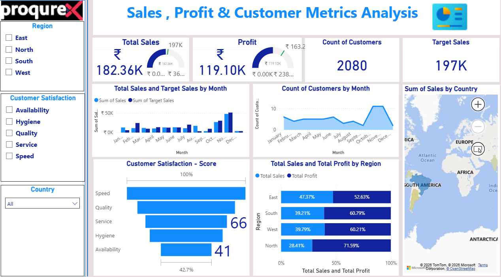

# powerbi-sales-dashboard
# Sales, Profit & Customer Metrics Analysis | SQL & Power BI

# Project Overview
This project focuses on analyzing Sales, Profit, and Customer metrics using SQL
for data analysis and Power BI for interactive visualization.
The dashboard helps understand regional performance, customer behavior,
monthly trends, and customer satisfaction drivers.

# Tools & Technologies
- SQL (Data querying and aggregation)
- Power BI Desktop (Data visualization)
- Excel (Raw dataset)

## 🔄 Project Workflow
1. Imported sales and customer data into SQL database
2. Used SQL queries to calculate KPIs such as total sales, profit, and customer count
3. Performed monthly and regional analysis using SQL
4. Built an interactive Power BI dashboard with slicers and KPIs

# Key KPIs
- Total Sales
- Total Profit
- Count of Customers
- Target Sales vs Actual Sales
- Customer Satisfaction Score

# Dashboard Analysis
- Monthly comparison of **Total Sales vs Target Sales**
- Monthly trend of **Customer Count**
- Region-wise comparison of **Total Sales and Total Profit**
- Country-wise sales distribution using map visualization
- Customer satisfaction analysis based on:
  - Speed
  - Quality
  - Service
  - Hygiene
  - Availability

#  Filters & Interactivity
- Region filter (East, West, North, South)
- Country slicer
- Customer satisfaction category filters

# 📷 Dashboard Preview

# Repository Structure
- sql/ – SQL queries used for sales and customer analysis
- powerbi/ – Power BI dashboard (.pbix file)
- data/ – Raw dataset (Excel)
- Dashboard.png – Dashboard screenshot

# Key Insights
- Identified regions contributing highest profit margins
- Analyzed gap between target sales and actual sales by month
- Observed customer satisfaction factors impacting sales performance
- Found seasonal trends in customer count and sales volume

# Author
Yogesh Baranwal
